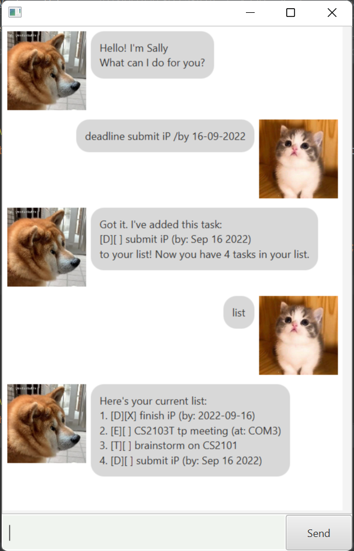

# Sally User Guide

Sally is a desktop application as a **daily task manager bot**.

## Table of Contents
- [Quick Start](#quick-start)
- [Features](#features)

--------------------------------------------------------------------------------------------------------------------

## Quick start

1. Ensure you have Java `11` or above installed in your Computer.

2. Download the latest `sally.jar` ([here](releases/download/A-Release-2/sally.jar)).

3. Copy the file to the folder you want to use as the _home folder_ for your Sally.

4. Double-click the file to start the app. The GUI similar to the below should appear in a few seconds. 
   

5. Refer to the [Features](#features) below for details of each command.

--------------------------------------------------------------------------------------------------------------------

## Features

### Adds `todo` task

- written in`todo DESCRIPTION`, where `DESCRIPTION` is the todo description.
- Example: `todo read book`

### Adds `deadline` task

- written in`deadline DESCRIPTION /by TIME`, where `DESCRIPTION` is the deadline description, and `TIME` is the given deadline.
- `TIME` using dates must be written in the form of `dd-mm-yyyy`, otherwise can be written without any format.
- Example: `deadline do CS2103T quiz /by 16-09-2022` or `deadline do CS2103T quiz /by tonight`

### Adds `event` task

- written in`event DESCRIPTION /at VENUE`, where `DESCRIPTION` is the event description, and `VENUE` is the event venue.
- Example: `event tP meeting /at COM3`

### `list` all tasks

- displays all the task list.
- Example: `list`

### `mark` a task

- marks a task based on the given number.
- written in `mark INDEX` where `INDEX` is the task number to be marked as done.
- Example: `mark 2`

### `unmark` a task

- unmarks a task based on the given number.
- written in `unmark INDEX` where `INDEX` is the task number to be unmarked.
- Example: `unmark 3`

### `delete` a task

- deletes a task based on the given number.
- written in `delete INDEX` where `INDEX` is the task number to be deleted.
- Example: `delete 2`

### `find` a task

- finds a task containing the given keyword.
- written in `find KEYWORD` where `KEYWORD` is the keyword used to filter tasks.
- Example: `find meeting`

### `help`

- displays command lists
- Example: `help`

### say `bye` to Sally

- bid farewell to Sally to save your list
- Example: `bye`

--------------------------------------------------------------------------------------------------------------------

## Have fun navigating through Sally!
